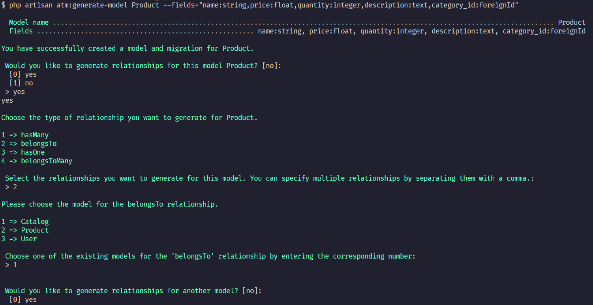

# Laravel Model Maker

Laravel Model Maker is a package that simplifies the process of generating models, migrations, and relationships in Laravel projects. It provides a set of artisan commands to create models with their corresponding migrations and relationships in a single command.

## Features

- Generate models with their corresponding migrations.
- Create relationships (hasOne, hasMany, belongsTo, and belongsToMany) between models.
- Easy to use artisan commands with a simple syntax.

## Installation

To install the Laravel Model Maker package, use the following composer command:

```bash
composer require amohamed/laravelmodelmaker --dev
```

It is recommended to only require the package for development.

## Usage

To generate a model and its migration, use the `generate-model` command:

```bash
php artisan atm:generate-model ModelName --fields="name:string:nullable,age:integer:unsigned:default(18),email:string:unique"
```

This command will create a model named `ModelName` in the app directory and its corresponding migration in the database/migrations directory. The migration will contain the name and age `fields`.

## Generate Relationships

To generate relationships for an existing model, use the atm:generate-relationship command:

```bash
php artisan atm:generate-relationship
```

This command will prompt you to choose the desired relationships and related models for the specified model.

## Example




## Available Options and Flags

```bash
$ php artisan atm:generate-model Post --fields="title:string,description:string:nullable,user_id:foreignId"

  Model name ................................................................................................................... Post  
  Fields ................................................................... title:string, description:string:nullable, user_id:foreignId  

Model and migration created successfully.

Would you like to generate relationships for this model? (yes/no) [no]:
> yes

Available relationship options:
1 => hasMany
2 => belongsTo
3 => hasOne
4 => belongsToMany

Select the relationships you want to generate for this model. You can specify multiple relationships by separating them with a comma.
> 1,2

Enter the related model for the 'hasMany' relationship:
> Comment

Enter the related model for the 'belongsTo' relationship:
> User

Relationships generated successfully.
```

## Contributing

Contributions, issues, and feature requests are welcome! Feel free to open an issue or create a pull request.

## License

This package is released under the [MIT License](https://opensource.org/licenses/MIT).
